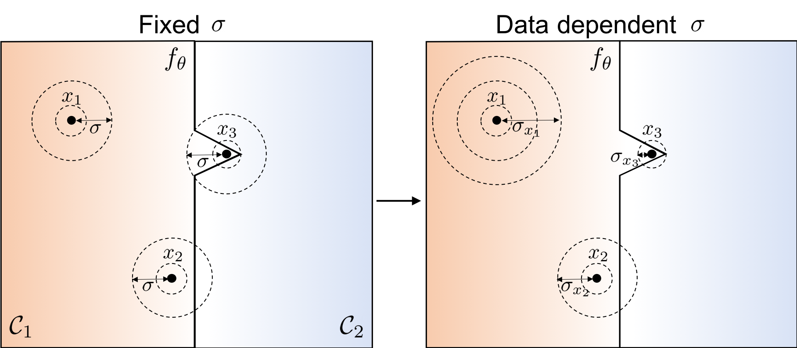

# Data Dependent Randomized Smoothing
This is the official repo for the work "Data Dependent Randomized Smoothing"

Preprint: https://arxiv.org/pdf/2012.04351.pdf



## Environment Installations:
First, you need to install the environment from the provided yml file by running:

`conda env create -f ddsmoothing.yml`

Then, activate the envionment by running:

`conda activate ddsmoothing`

## Reproducing our Results:

For Cifar10 results, navigate to CIFAR10 directory by running `cd CIFAR10` and run the corresponding main file with the hyperparameters mentioned in the paper. For ImageNet results, the pretrained weights shall be downloaded from the original repo of the corresponding paper. Also, modify `all_datasets.py` for the path where ImageNet is saved.

## Certifying the model with data dependent smoothing.

To Certify a model with data dependent randomized smoothing, we use the repo https://github.com/locuslab/smoothing where we replace `certify.py` with `certify_ds.py`. 

## Wanna Use DS in a New RS Training framework ?

No problem, all what you need is to use the code in `optimze_sigma.py` within the training fromwork. Upon training, run `optimze_sigma.py` for the samples in the test set with propper setting of the hyperparameters. Certify the final model with the output parameters gotten from the previous step. Alternatively, you can install our package that contains the code for the optimization and certification by running:

`pip install ddsmoothing-python`

Next, import the package in your python code by running"

`import ddsmoothing`

Then import the opimization class `OptimizeIsotropicSmoothingParameters` from our package in your python code. This class takes a PyTorch model, a DataLoader and a device. 

`def __init__(self, model: torch.nn.Module, test_loader: torch.utils.data.DataLoader, device: str = "cuda:0"):`


Next, you need to define the `Certificate` class (either `L2Certificate` or `L1Certificate` depending on the norm of interest). You need to pass the batch size to this class.

`def __init__(self, batch_size: int, device: str = "cuda:0"):`

Finally, you can run the optimization by calling the `run_optimization` method from the `OptimizeIsotropicSmoothingParameters` class.

`def run_optimization(self, certificate: Certificate, lr: float, theta_0: torch.Tensor, iterations: int, num_samples: int, filename: str = './'):`

where:


certificate (Certificate): instance of desired certification object.

lr (float, optional): optimization learning rate for Isotropic DDS.

theta_0 (torch.Tensor): initialization value per input of the testloader.

iterations (int): Number of iterations for the optimization.

num_samples (int): number of samples per input and iteration.

filename (str, optional): name of the file of the saved thetas.


For further details, please check the examples in `ddsmoothing/scripts`. If you use this repo, please cite us:
```
@article{DBLP:journals/corr/abs-2012-04351,
  author    = {Motasem Alfarra and
               Adel Bibi and
               Philip H. S. Torr and
               Bernard Ghanem},
  title     = {Data Dependent Randomized Smoothing},
  journal   = {CoRR},
  volume    = {abs/2012.04351},
  year      = {2020},
  url       = {https://arxiv.org/abs/2012.04351},
  archivePrefix = {arXiv},
  eprint    = {2012.04351},
  timestamp = {Wed, 09 Dec 2020 15:29:05 +0100},
  biburl    = {https://dblp.org/rec/journals/corr/abs-2012-04351.bib},
  bibsource = {dblp computer science bibliography, https://dblp.org}
}
```

This repository is licensed under the terms of the MIT license.
